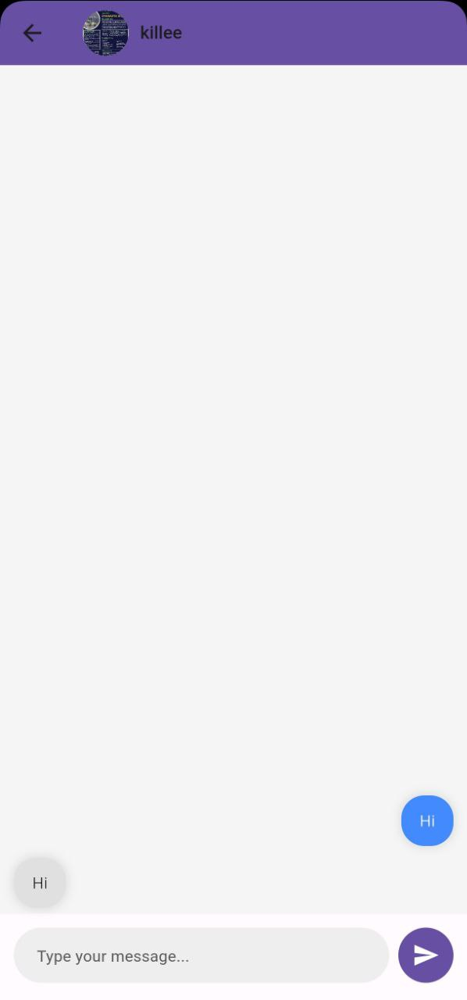

# Chat Application

Chat Application is a Flutter-based mobile app that uses Firebase for authentication, real-time chat functionalities, and user management. This app features a modern and intuitive design for seamless communication and user interaction.

## Features

- **User Authentication**: Secure sign-up and sign-in functionality using Firebase Authentication.
- **Real-Time Chat**: Engage in real-time conversations with instant message updates.
- **Multi-Chat Support**: Manage multiple chat conversations simultaneously.
- **User Profiles**: Personalize user profiles with custom images and details.

## Technologies Used

- **Flutter**: For building a cross-platform mobile application with a modern UI.
- **Firebase Authentication**: For secure user authentication and account management.
- **Firebase Firestore**: For storing and managing chat data in real-time.
- **Firebase Storage**: For handling user profile images and other media.

## Screenshots

  
 
 
 

## Acknowledgments

- Special thanks to the Firebase team for their comprehensive tools and services.
- Inspired by the need for effective real-time communication and user management in modern applications.
